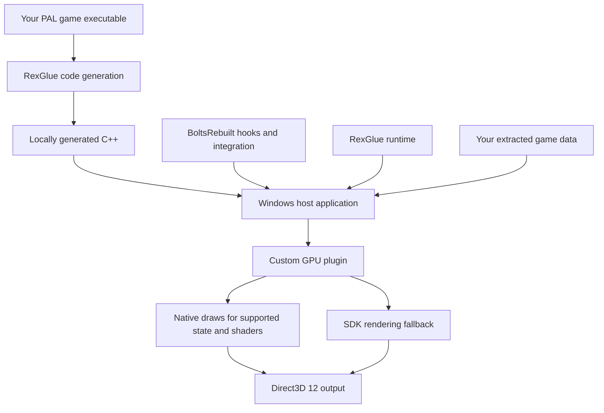

# How BoltsRebuilt works

[Back to the project](../README.md) · [Build and play](BUILDING.md)

BoltsRebuilt combines static recompilation of the game's CPU code with a custom
native graphics path. The public repository supplies the host-side implementation
and tooling. Each tester generates the game-derived code and shaders locally
from the supported PAL executable and their own game data.

## Local build and runtime

The host integrates game compatibility hooks, audio, input, UI overlays, and
ultrawide camera behavior. The internal names `nb` and `rexgpu-nb` remain in the
build and runtime interfaces; the public project name is BoltsRebuilt.

## Rendering

The GPU plugin retains RexGlue's Xenia-derived command-stream parsing and shared
resource infrastructure. For supported draws it binds a native geometry path
with translated shaders, guest vertex/index data, constants, textures and samplers.
Draws that cannot use that path fall back to the SDK renderer.

Both paths participate in the same resource and render-target handling. The
vendored graphics changes cover command recording/replay, memory upload behavior,
texture lookup, and render-target transfer and resolve work. Their upstream
revision and change record are documented in
[the vendored source notes](../src/gpu/vendored/UPSTREAM.md).

## Local shader preparation

1. A capture run records shaders encountered while playing your own game.
2. The translator produces HLSL and metadata for supported shader stages.
3. The preparation helper validates and compiles stages before installing them
   in the local shader library.
4. The renderer loads the library and prepares runtime shader/pipeline
   combinations. Unsupported operations or state retain fallback.

Capturing another area can add more shaders. A successful translation is a
starting point for visual testing, not proof that every draw is correct.

## Ultrawide

The camera's horizontal field of view grows with the requested aspect ratio
while its vertical field of view is preserved. Culling follows the wider view,
the presenter uses the requested display aspect, and the HUD remains centered
at its original proportions. Internal render scale is a separate setting.

The [gallery](SCREENSHOTS.md) shows 32:9 output and a 16:9 comparison. The
[build guide](BUILDING.md#ultrawide-and-comparison) covers launch settings and
the F5/F9/F10 comparison controls.

## Source layout

| Directory | Purpose |
| --- | --- |
| [`src/gpu`](../src/gpu) | Custom GPU plugin, native rendering, and modified upstream graphics code |
| [`src/hooks`](../src/hooks) | Game compatibility and camera hooks |
| [`src/ultrawide`](../src/ultrawide) | Aspect ratio, render-scale and camera support |
| [`src/audio`](../src/audio), [`src/input`](../src/input), [`src/ui`](../src/ui) | Host integration and diagnostics |
| [`tools`](../tools) | Build/play helpers, shader tools, analysis scripts, and tests |
| [`config`](../config) | Runtime defaults, compatibility boundaries and hook declarations |
| [`sdk-patches`](../sdk-patches) | Patches applied to the pinned RexGlue SDK |
| [`cmake`](../cmake), [`generated/rexglue.cmake`](../generated/rexglue.cmake) | Build integration; generated game source is kept local |

For source origins, licensing boundaries and excluded material, see
[provenance](PROVENANCE.md) and [third-party notices](../THIRD_PARTY_NOTICES.md).
