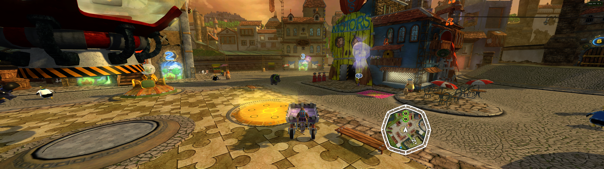
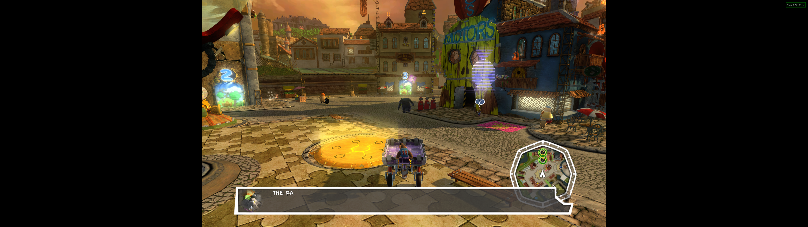
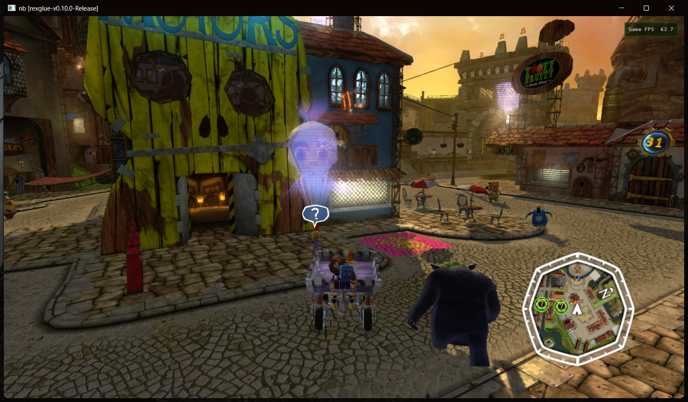
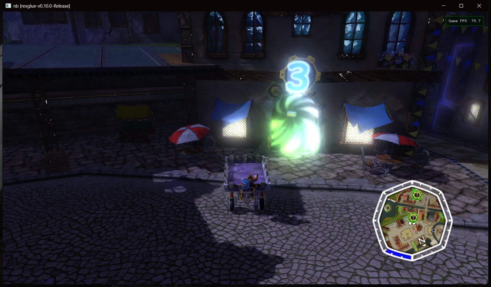
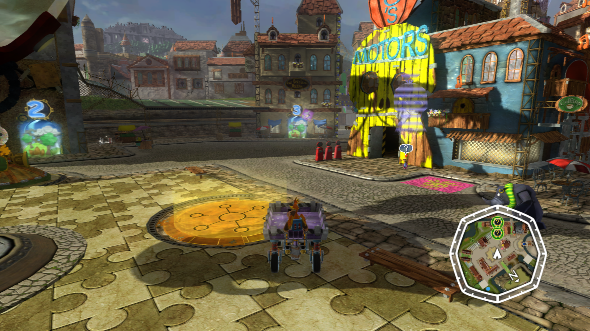
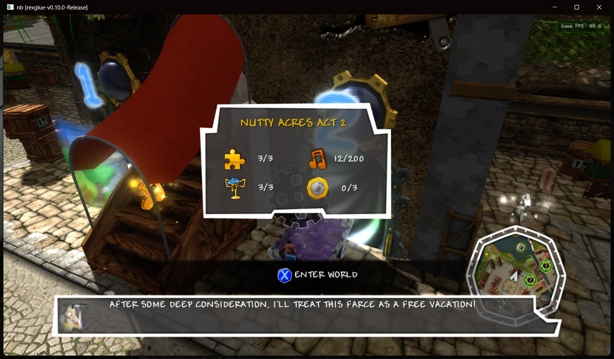

# Screenshot gallery

[Back to the project](../README.md) · [Build and play](BUILDING.md)

These images come from local development and benchmark sessions in September
2026. They show the project in use, including ultrawide framing, the game UI,
and different lighting conditions in Showdown Town.

The captures predate the public source preview and may include experimental
settings and local shader/asset caches. They are not a full-game compatibility
claim or a benchmark of the public build. Any visible FPS figure is an individual
overlay reading. Each PNG is copied unchanged from its original capture file.

## Ultrawide: 32:9

**5120 × 1440 output, 4×2 internal render scale.** The camera shows more to the
sides while preserving its vertical field of view. The HUD stays within a
centered 16:9 region instead of being stretched to the display edges.

## The same session at 16:9

The 16:9 view is shown on the same 5120 × 1440 display with black side bars.
This was captured later in the session: moving characters, lighting and dialogue
can differ between frames. Compare the horizontal view and HUD placement, rather
than treating the pair as a pixel-identical rendering or performance comparison.

## Driving through Showdown Town

A windowed street view from a driving test with native rendering enabled.
The title bar and FPS overlay are part of the original capture.

## After dark

Another driving-test capture, showing the portal and nearby street lighting.

## A closer look at the HUD

This is an existing **2560 × 1440 center crop** from a separate 32:9 session
using 2×2 internal render scale. It shows the central composition and HUD detail;
it is not a complete 16:9 camera view.

## World-entry interface

The game’s world-entry panel and dialogue during a driving test in Showdown Town.
This image documents the interface, not a completed playthrough of that world.

## Capture record

| Image | Capture date (UTC) | Image dimensions |
| --- | --- | --- |
| Ultrawide view | 12 September 2026 | 5120 × 1440 |
| 16:9 comparison | 12 September 2026 | 5120 × 1440, including side bars |
| Street view | 10 September 2026 | 1618 × 947, including window frame |
| Night view | 10 September 2026 | 1618 × 947, including window frame |
| HUD detail | 12 September 2026 | 2560 × 1440, existing center crop |
| World-entry interface | 10 September 2026 | 1618 × 947, including window frame |

The [image manifest](screenshots/manifest.json) records original capture names,
timestamps, dimensions and SHA-256 hashes. The publication check permits only
the listed image contents. Click any image to inspect its original resolution.

The visible game artwork and trademarks belong to their respective rights
holders and are not covered by this repository's GPL source-code license.
These screenshots document the implementation; no extracted textures, models,
or other game asset files accompany them. The project is not affiliated with
or endorsed by Rare or Microsoft. Microsoft's
[Game Content Usage Rules](https://www.xbox.com/en-us/developers/rules) have their
own conditions and do not establish blanket permission for a recompilation project.
