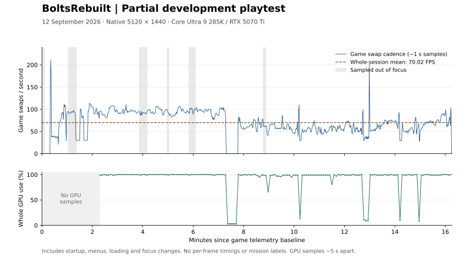

# Partial development playtest — 12 September 2026

**Native 5120 × 1440, 32:9: 70.02 FPS average game swap cadence over 16 minutes
16 seconds of recording.** This whole-session result includes startup, menus,
loading and time out of focus. The native renderer was enabled, with fallback
for unsupported draws.

This was the maintainer's private development build with local shaders and
caches. It is development evidence, not a benchmark of `v0.1.0-preview.1` or a
prediction for other hardware.

## Progress reported

The maintainer stopped the session voluntarily and reported:

> I didn't play through the entire game, but I got through the first level and
> the first mission, and then the second level and then the first mission with
> Mumbo.

The level and mission wording is preserved as reported; named worlds and
individual mission completion were not independently checked. The recording has
no mission timestamps, so the performance samples cannot be assigned to those
missions. This does not establish full-game completion, every challenge in those
levels, or save/reload reliability.

The process exited with code **0** after the window closed. Runtime diagnostics
still reported unimplemented compression-information queries and unsupported
native draws, including texture-fetch fallbacks. A normal exit does not establish
that the session was free of visual or gameplay issues.

## Performance recording



The upper plot shows every approximately one-second sample. Gray shading marks
intervals whose endpoint was sampled out of focus. The lower plot starts later
because GPU collection began about 2 minutes 18 seconds into the recording.
Connecting lines do not add measurements between samples.

| Game measurement | Result |
| --- | ---: |
| Recorded interval | 12 September, approximately 21:13:44–21:30:00 EDT (UTC−4) |
| Sampling windows / observed duration | 976 / 976.00 seconds |
| Completed game swaps | 68,343 |
| Whole-session average swap cadence | **70.02 FPS** |
| Average over intervals sampled in focus | 69.17 FPS across 898.00 seconds |
| Lowest / highest one-second sample | 0.00 / 210.91 FPS |
| Process CPU use, time-weighted mean / peak sample | 16.22% / 87.03% of total logical CPU capacity |
| Process working set, peak sample | 20,594 MiB |
| Process private memory, peak sample | 12,654 MiB |

Focus is sampled at the end of each interval. The in-focus subset still includes
menus, loading and pauses; it is not a gameplay-only benchmark. All 48 zero-swap
windows remain in the whole-session result. Working set includes resident shared
and mapped memory; it is a different measure from private memory.

The GPU recorder collected **166 samples** approximately five seconds apart,
from **21:16:02.247 to 21:29:57.804 EDT**, with no reported query errors. Its
averages are arithmetic means of the available samples, over that shorter period.

| Whole-device GPU measurement | Sample mean | Peak sample |
| --- | ---: | ---: |
| Utilization | 92.90% | 100% |
| Memory used | 7,387 MiB | 8,637 MiB |
| Temperature | 62.09 °C | 70 °C |
| Power | 199.34 W | 261.50 W |
| Graphics clock | 2,892 MHz | 2,925 MHz |

These are readings for the entire NVIDIA GPU, including other applications.
Memory used is not a measurement of game-only VRAM allocation.

## Hardware and runtime

| Setting | Recorded configuration |
| --- | --- |
| CPU / RAM | Intel Core Ultra 9 285K, 24 cores / 24 logical processors; 32 GB RAM |
| Selected GPU | NVIDIA GeForce RTX 5070 Ti, 16 GB class (16,303 MiB reported) |
| NVIDIA driver | 616.56; Windows driver 32.0.16.1656 |
| OS | Windows 11 IoT Enterprise LTSC, build 26100 |
| Display | MSI MPG 491C OLED, 5120 × 1440 at 144 Hz |
| Window / aspect / internal scale | Fullscreen, 32:9, explicit `4x2` scale for native 5120 × 1440 |
| Renderer | `gpu_plugin=nb`, `nb_native_generic=true`; unsupported draws can fall back |
| Local shader library | 717 vertex and 3,690 pixel stages loaded; shader capture disabled |
| Local asset caches | Texture cache enabled with a 33-entry pack; geometry cache mode 0 (disabled) |
| Guest pacing | Refresh setting 480 Hz, permitting up to 240 game swaps/s; VSync enabled |

The launcher requested `4x2`, the runtime logged that scale and 32:9 presentation,
and all 969 samples with available client dimensions reported 5120 × 1440. The
first seven samples had no client dimensions. Window size alone does not measure
internal render scale. No F5/F6/F9 mode-change messages were found, and the saved
runtime configuration was unchanged after the session.

The display refresh is distinct from game swap cadence. Loaded shader counts
also do not establish that every draw used a native shader or rendered correctly.
The local library and texture pack are not supplied with the public preview.
See [test hardware](../../TEST_HARDWARE.md) and
[compatibility limits](../../COMPATIBILITY.md) for more context.

<details>
<summary>Recorded build identity</summary>

The development checkout was based on
`96b24b7964900b7dc06a8fed3aeb80c4bc19634e`, with uncommitted changes. That source
state is not proof of the exact source compiled into these binaries. The recorded
SHA-256 hashes identify the files used for this session:

| File | SHA-256 |
| --- | --- |
| `nb.exe` | `f74448f9ecb00f6cdccf74fc9fe7e8a2390e3945c0d2760907dbd341fd969ec5` |
| `rexgpu-nb.dll` | `d60fdec99d7a36699e4773c7e97d37dd96ff62c37e75d95ae3f90cfe80af6d8b` |
| `rexruntime.dll` | `fb0964f80b2a5c31c6e5feb77180b8ec71c94f8443a89cf5d044a9dd730711da` |

The binaries and private inputs are not distributed with this report. Building
the public tag does not reproduce this development configuration.

</details>

## Method and downloadable data

The recorder read the completed game-swap counter used by the in-game Game FPS
overlay approximately once per second. It made a read-only, eight-byte process
memory read; it did not inject code or suspend the game. The counter advances
after the native plugin's `IssueSwap` returns and includes fallback rendering.
It measures completed game-swap calls, not display refresh, GPU fence completion
or individual frame times. **True 1% lows and per-frame stutter percentiles cannot
be derived from this recording.**

Average cadence is `sum(swap_delta) / sum(interval_seconds)`. The observed
intervals range from 0.916 to 1.084 seconds; their durations are used rather than
assuming exactly one second per sample. Recording starts at the attachment
baseline and ends at the last successful sample. Time before attachment and the
final unsampled partial interval are excluded. Recorder overhead was not measured.

- [Game samples (CSV)](game-samples.csv): every recorded interval, swap delta,
  cadence, process CPU/memory, focus state and available client dimensions.
- [GPU samples (CSV)](gpu-samples.csv): whole-device readings from `nvidia-smi`.
  `elapsed_seconds` has been aligned approximately to the game telemetry baseline
  using the original UTC timestamps. The original GPU recorder had a separate
  time origin. This is time-series alignment, not synchronization to a game frame.
- [Summary and plot script](summarize.py): recalculates the tables from the
  published samples using Python's standard library; `--plot` redraws the SVG
  when Matplotlib is installed.

Personal paths, process IDs, memory addresses and raw runtime logs are omitted.
The CSVs contain numerical telemetry only. Game sample values retain their
original rounding; GPU elapsed times are the only transformed measurements.
No scene, mission or performance-based sample filtering was applied.

From the repository root:

```console
python docs/benchmarks/2026-09-12-ultrawide/summarize.py
```

This is one exploratory session. A repeatable route, explicit mission markers,
per-frame capture, cold/warm shader separation and a run of the public build are
still needed for a controlled comparison.
